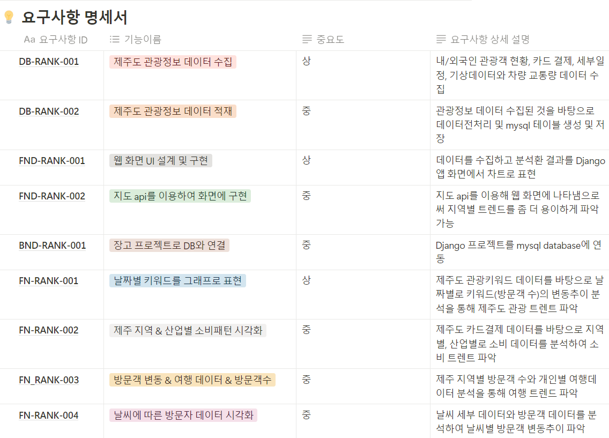

# SKN03-2nd-4Team
---
Trandigo

# 2nd-project-sample
### 프로그래밍과 데이터 기초 교과목 단위 프로젝트 SR(Software Requirement) 안내 
**SR(Software Requirement)** 이란 **프로젝트에서의 요구되는 것들이 무엇인지를 구체화 및 문서화하는 것**을 의미합니다. 
프로젝트에서 구현해야 할 기능에 대해 구성원 전체가 논의하고 기획한 내용을 SR에 작성하도록 합니다.
참고자료로 제공해드리는 및 아래의 READ.MD를 꼭 참고하여 SR을 작성해주세요. 

   

## 1. 팀 소개
### 팀명 : Trandigo 팀
### 팀원 소개
<table align="center">
  <tbody>
    <tr>
      <td align="center">
        

          
           <a href="https://github.com/artemIntellectus">
팀장 오승민
</a>
        

      </td>
      <td align="center">
        

          
          <a href="https://github.com/jeehun98">
김지훈
</a>
        

      </td>
      <td align="center">
        

          
          <a href="https://github.com/5-lee">
이준석
</a>
        

      </td>
      <td align="center">
        

          
            <a href="https://github.com/{깃헙주소}">
하은진
</a>
        

      </td>
      <td align="center">
        

          
          <a href="https://github.com/Gunayeon">
구나연
</a>
        

      </td>
    </tr>
  </tbody>
</table>

   

## 2. 프로젝트 개요 
### 개발 기간 
2024-08-14 ~ 2024-08-19
### 프로젝트 명 
🍊<b>제주도 관광 트렌드 시각화 시스템</b>🍊
### 프로젝트 소개 
저희'Trandigo'는 제주도의 관광 데이터를 활용하여, 방문객의 목적, 연령대, 소비 패턴에 기반한 개인화된 관광 일정을 제공합니다. 우리의 목표는 관광객의 경험을 극대화하고, 제주도의 지역 경제를 활성화하는 것입니다. 이를 통해 관광객의 만족도를 높이며, 제주도의 관광 자원을 효율적으로 활용하여 지속 가능한 관광 산업 발전에 기여하고자 합니다.
### 프로젝트 내용 
#### 프로젝트 배경 
제주도는 한국의 주요 관광지로, 다양한 관광 자원과 아름다운 자연경관 덕분에 매년 많은 관광객이 방문합니다. 이 프로젝트는 제주도를 방문하는 내국인과 외국인 관광객의 행동 데이터를 분석하여 개인화된 관광 일정을 제공하고, 관광 트렌드를 파악함으로써 관광객 경험을 향상시키고 지역 경제를 활성화하는 것을 목표로 합니다. 데이터 분석을 통해 관광객의 소비 패턴과 선호도를 이해하고, 이를 바탕으로 효율적인 관광 마케팅과 맞춤형 서비스를 제공하여 제주도의 관광 산업에 기여하고자 합니다.
#### 프로젝트 목표 
- **📝관광객 패턴 분석📝**: 내국인 및 외국인 관광객의 관광 목적, 방문 형태, 그리고 소비패턴을 분석하여 관광객의 선호도를 파악하고 맞춤형 관광정보 제공

- **🪙경제 및 소비 트렌트 파악🪙**: 카드 결제 데이터를 활용해 연령별 및 업종별 소비 트렌드를 분석하고, 지역 경제의 동향을 이해하여 관광객들에게 더 나은 추천 서비스를 제공합니다.

- **🌴관광지 및 활동 분석🌴**: 여행 세부 일정 데이터를 통해 인기 관광지와 활동을 식별하고, 관광지의 매력도를 평가하여 관광 일정을 최적화합니다.
- **🌦️날씨와 관광패턴🌦️**: 기상 데이터를 분석하여 날씨에 따른 관광 패턴 변화를 예측하고, 관광 계획에 반영하여 관광객의 만족도를 관리합니다.
- **🚠교통 혼잡도 예측 및 최적화🚠**: 차량 교통량 데이터를 분석하여 도로별 혼잡도를 예측하고, 관광객의 이동을 효율적으로 관리합니다.
   

## 3. WBS 
| 오승민님 (팀장) | 김지훈님 | 이준석님 | 하은진님 | 구나연님 |
|:----------:|:----------:|:----------:|:----------:|:----------:|
|프로젝트 전체 관리 및 조율|데이터 수집, 전처리, 통합, 데이터베이스 관리|사용자 인터페이스 개발, 지도 시각화 구현|AWS 기반 인프라 구축 및 관리, 배포 및 모니터링|Django 기반의 서버 및 API 개발, 데이터베이스 연동. |

   

## 4. 기술 스텍
| Data Modeling | DB | Front-End |   Back-End   | Deployment
|------------|--------|-------------|------------|----------|
|     |   |    | |

   

## 5. 요구사항 명세서
요구사항 명세서는 프로젝트의 기능을 중요도에 따라 구분하고, 세부적으로 구현해야 할 기능들을 우선순위에 따라 배치합니다. 이를 통해 프로젝트를 보다 효율적으로 진행할 수 있도록 설계되었습니다. 저희 <b>Trandigo</b>는 이러한 방식으로 기능별 우선순위를 매겨 프로젝트를 보다 체계적으로 관리할 수 있었습니다.
 

- 요구사항 ID : 요구사항별로 유일한 ID를 부여하여 기입합니다. 저희는 프로젝트의 포괄적인 기능 별로 ID를 정의하였습니다. 

- 기능구분 : 도출된 요구사항을 간략하게 요약하여 기입하였습니다. 

- 중요도 : 해당 요구사항의 전체 시스템 구현 측면에서의 중요도를 기술하였습니다. (상, 중, 하) 
- 요구사항 상세 설명 : 기능이름에 더하여 부가적으로 기능을 구체적으로 기술하였습니다. 

   

## 6. ERD 설계서
Trandigo 프로젝트의 ERD(Entity-Relationship Diagram) 설계서는 제주도 관광 데이터 분석 시스템의 데이터 구조를 시각적으로 표현한 다이어그램입니다.  이 설계서는 다양한 관광 관련 데이터를 효율적으로 관리하고 분석하기 위해, 각 데이터 간의 관계와 구조를 명확하게 정의합니다.   ERD 설계를 통해 관광객의 방문 목적, 연령대, 소비 패턴 등 복잡한 데이터를 체계적으로 관리하고, 이를 기반으로 추가적인 기능도 구현할 수 있습니다.  

 

   

## 7. 주요 프로시저

   

##  8. 프로젝트 결과 
- 테스트/ 시연 이미지 삽입

| 차량 소비자 증가 그래프 | 국산 차량 브랜드 순위 | 
|--|--|
|  |  |
| 상위 차량 브랜드의 모델 | 상위 차량 브랜드 통합 FAQ 조회 시스템 |
|  | 

   

## 9. 개발 규칙 
**Code 작성 규칙**
- 패키지명 전체 소문자
- 클래스명, 인터페이스명 CamelCase
- 클래스 이름 명사 사용
- 상수명 SNAKE_CASE

**Git Branch 전략**
유형별로 구분하여 작성하고 Git Flow 적용
- **feat** : 새로운 기능 추가
- **fix** : 버그 수정
- **docs** : 문서 수정
- **style** : (코드의 수정 없이) 스타일(style)만 변경(들여쓰기 같은 포맷이나 세미콜론을 빼먹은 경우)
- **refactor** : 코드 리펙토링
- **test** : Test 관련한 코드의 추가, 수정
- **chore** : (코드의 수정 없이) 설정 변경

**협업 Rules**
- Discord ,Notion 활용
- 지각이나 결석은 꼭 말해주기 

   

## 10. 오류 해결 과정
### 페이지 로딩 시간 초과
- **문제**: 페이지 로딩 시간이 오래 걸려 타임아웃 오류 발생.
- **해결**: 로딩 시간을 연장하거나, 페이지가 로드되기 전에 필요한 데이터만 우선적으로 로드하도록 수정.

### API 응답 지연
- **문제**: 외부 API 응답이 지연되어 데이터 수집에 차질 발생.
- **해결**: 비동기 요청을 사용하여 API 응답을 기다리는 동안 다른 작업을 수행하도록 개선. 또한, 응답 지연 시 재시도 로직 추가.

### 데이터 저장 시 데이터베이스 연결 오류
- **문제**: 데이터 저장 과정에서 데이터베이스 연결 오류 발생.
- **해결**: 연결 타임아웃 시간을 늘리고, 연결 재시도 로직을 추가하여 안정성을 향상.

   

##  11. 한줄 회고 
데이터 수집과 분석을 통해 국산차 선호도 정보를 효과적으로 제공함으로써 소비자와 제조업체 모두에게 가치 있는 인사이트를 제공한 의미 있는 경험이었다.
