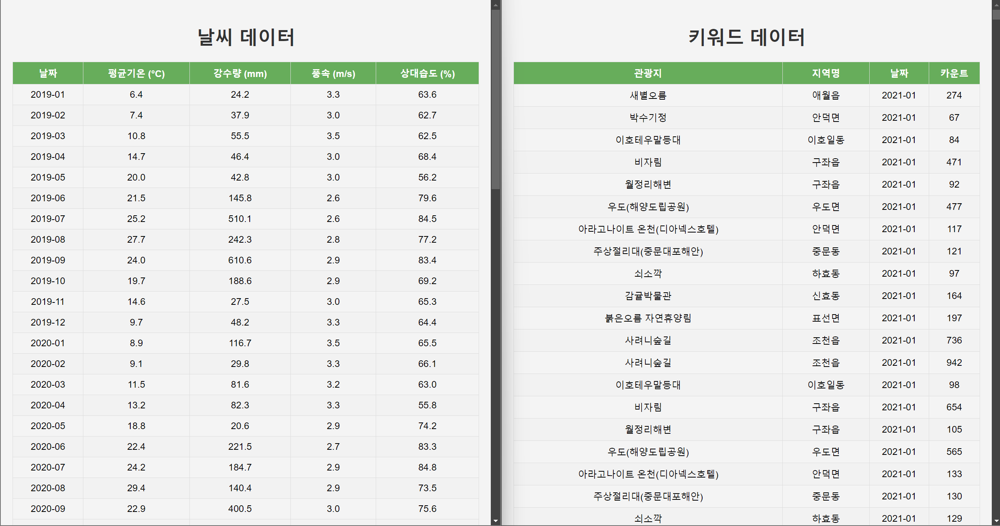

# django 기본 구성 

먼저 수집한 데이터들을 django 를 통해 화면에 출력해봤습니다.

단순히 각 데이터들이 저장되어 있는 엑셀 파일을 화면에 표시했고,

이후 데이터에 적합한 형태로, 날짜별로 분리해서 화면에 표시할 수 있을 것 입니다.

인원별로 

-----------------------

### 데이터_app/view

### templates/데이터_app/데이터.html

### static/css/데이터별.css

----------------------

위 파일의 수정 및 추가로 각 app 별 화면에 출력되는 형태를 변경해주시면 됩니다. (다른 파일도 수정해야 하면 바꿔주세요)

https://public.tableau.com/app/profile/.r.d./vizzes

위 링크를 통해 어떻게 화면에 표시할 지 참고 할 수 있을 것 같네요, 

----------------

### 우선적으론 데이터를 날짜별로 나눠 표시해야 하고, 

### 날짜 선택 시, 해당 날짜에 해당하는 데이터가 출력되도록 해주세요

날짜 선택 - 선택된 날짜의 데이터 프레임내 검색 - 해당 데이터 출력 식으로 할 수도 있을 것 같네요

(나중에 출력되는 화면, 프론트가 바뀌더라도 날짜를 변경하는 로직은 그대로 사용할 수 있기 때문!)

# 데이터 종류
-------------

### ● consumption_industry : 업종별 매출액(억)

### ● consumption_region : 지역별 매출액(억)

### ● keyword : 관광지 검색량

### ● visitor_jeju : 내/외국인의 제주 지역별 방문 인구 수

### ● visitor_region : 육지의 지역별 제주 방문 인구 수

### ● weather : 날씨

_______

작업 전에 디스코드로 다른 어떤 데이터를 맡겠다고 말씀해주시고 작업해주세요 (다른 인원이 작업하고 있는 것과 겹치지 않도록 하기 위해...)

# 작업 시
-------- 

0. dev -> "작업할 데이터 명" 의 브런치 생성

1. git clone

2. 가상환경 설정

3. pip install -r requirements.txt 를 통해 패키지 설치 - 추가 패키지 설치 시 pip freeze > requirements.txt 명령어를 실행해주세요

----------
 
해당 작업을 통해 각각의 데이터에 대한 분석 결과를 얻을 수 있을 것입니다. (가장 단순하게 시간의 흐름에 따른 데이터의 변화 확인 가능)
